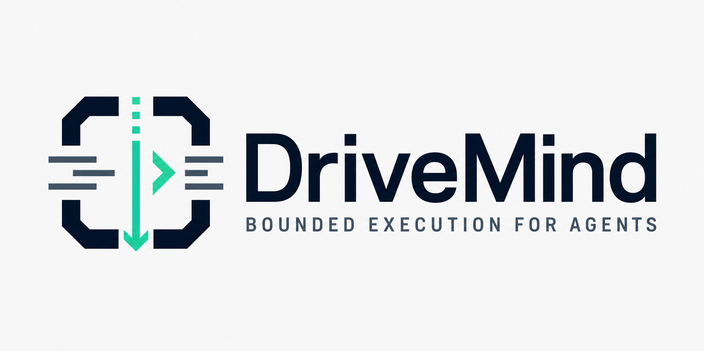

# DriveMind

[English](./README.md) · [简体中文](./README.zh-CN.md) · [GitHub Repository](https://github.com/Yuzc-001/DriveMind) · [Issues](https://github.com/Yuzc-001/DriveMind/issues)

> **Bounded execution for agents.**
>
> Keep hard work from degrading. Force better next moves. Preserve what makes the next run stronger.

DriveMind is a v0.7 agent skill for improving real task execution.

It exists for the moment when a model is capable of doing better, but the work starts to degrade: the goal drifts, pressure blurs the boundary, retries become fake motion, a session break damages continuity, or the agent settles for a shallow answer below its real capability.

DriveMind does not make an agent louder. It makes the next move harder to fake.

**Current release:** `v0.7.0`

---

## Product Center

DriveMind has three operating commitments:

1. **Execution integrity** — keep the work aligned, bounded, and recoverable.
2. **Execution ceiling** — push one stronger concrete move when the current result is below the model's reachable capability.
3. **Experience compounding** — close meaningful work with residue that improves the next run.

The core question is:

# What is most likely to degrade, and what would make the next move genuinely stronger?

---

## Failure Model

DriveMind targets six failure modes:

1. goal drift
2. boundary drift
3. continuity decay
4. stuck degeneration
5. capability underuse
6. closure failure

If a task does not risk one of these, direct execution is usually better.

---

## What Ships

- `skill/SKILL.md` — runtime entrypoint
- `skill/references/drift-prevention.md`
- `skill/references/boundary-preservation.md`
- `skill/references/stuck-recovery.md`
- `skill/references/execution-ceiling.md`
- `skill/references/continuity-preservation.md`
- `skill/references/closure-compounding.md`
- `skill/references/residue-selection.md`
- `skill/templates/` — review, diary, and distillation templates
- `scripts/` — hardened installers and bootstrap scripts
- `docs/` — v0.7 product, install, brand, and release docs
- `assets/` — Signal Gate visual system

---

## Activation Examples

- `Use DriveMind here. Keep the thread stable.`
- `This may drift if we keep going. Enable DriveMind.`
- `Stay with this, but ask before crossing a risky boundary.`
- `This is below what the model can do. Use DriveMind and force a better execution path.`
- `We may continue tomorrow. Preserve continuity.`
- `Review this afterward and leave behind a next-time rule.`

---

## Install

See [docs/installation.md](docs/installation.md).

DriveMind installs as one portable `drivemind` skill package for supported skill directories.

---

## Read Next

- [skill/SKILL.md](skill/SKILL.md)
- [docs/drivemind-v0.7-execution-ceiling.md](docs/drivemind-v0.7-execution-ceiling.md)
- [docs/drivemind-v0.7-stress-cases.md](docs/drivemind-v0.7-stress-cases.md)
- [docs/github-release-v0.7.0.md](docs/github-release-v0.7.0.md)
- [docs/installation.md](docs/installation.md)

---

## Contact

- Issues: <https://github.com/Yuzc-001/DriveMind/issues>
- Email: `zxyu24@outlook.com`
